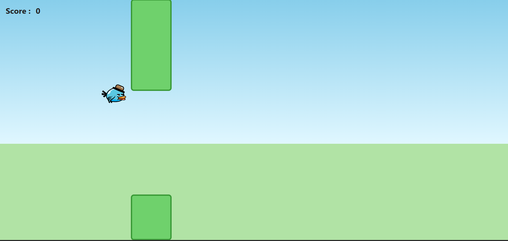
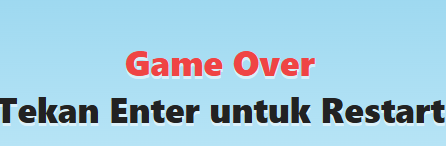
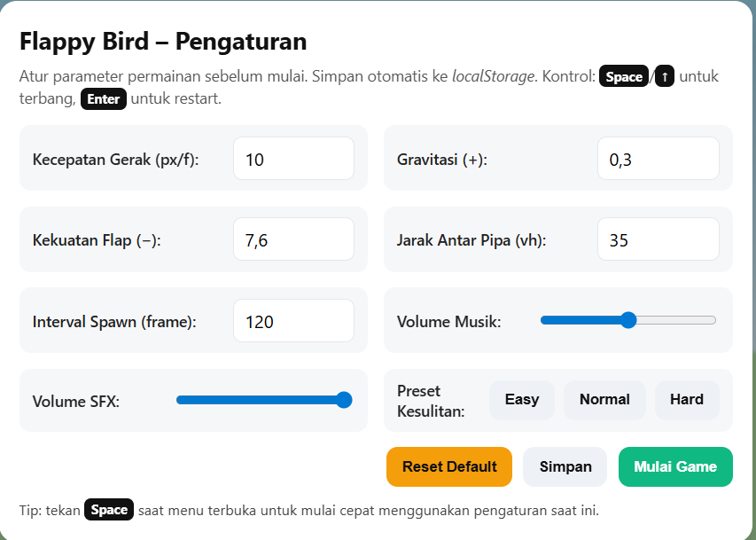

#Flappy Bird Game - JavaScript

A customizable Flappy Bird game built using HTML, CSS, and JavaScript.  
This project goes beyond a basic clone by introducing dynamic game settings, difficulty presets, and persistent configuration using localStorage.

---

##Features

- Real-time bird movement with gravity simulation
- Dynamic pipe generation system
- Collision detection (pipes & ground)
- Score tracking system
- Game over and restart mechanism
- Interactive settings panel before starting the game
- Difficulty presets (Easy, Normal, Hard)
- Adjustable parameters:
  - Movement speed
  - Gravity
  - Flap strength
  - Pipe distance
  - Spawn interval
- Sound control (Music & SFX volume)
- Local storage support (settings are saved automatically)

---

##Controls

- `Space` / `↑` → Flap (fly)
- `Enter` → Restart game
- `Space` (in menu) → Quick start with current settings

---

##What I Learned

This project helped me understand:

- Game loop implementation using JavaScript
- Simulating physics (gravity and jump mechanics)
- Real-time collision detection
- Managing game states (menu, playing, game over)
- DOM manipulation for dynamic UI
- Using localStorage for persistent data
- Designing configurable systems instead of static gameplay

---

##Screenshots

### Gameplay

### Game Over

### Settings Panel

---

## 🚀 Live Demo

(Add GitHub Pages link here)

---

## 📁 Tech Stack

- HTML
- CSS
- JavaScript (Vanilla)

---

## 📌 Project Purpose

This project is part of my journey as a Software Engineering student to deepen my understanding of interactive systems and game logic.

Instead of building a static clone, I focused on making the game configurable and reusable, similar to how real systems allow parameter tuning.

---

## 🔗 GitHub Repository

https://github.com/USERNAME/flappy-bird-javascript
